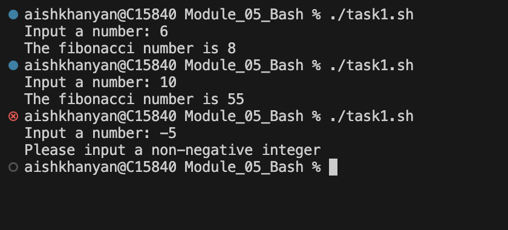
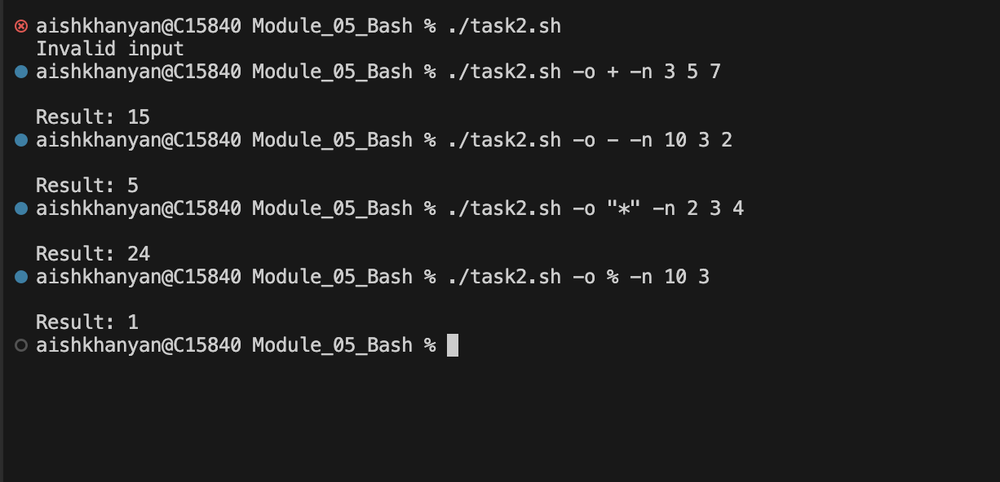
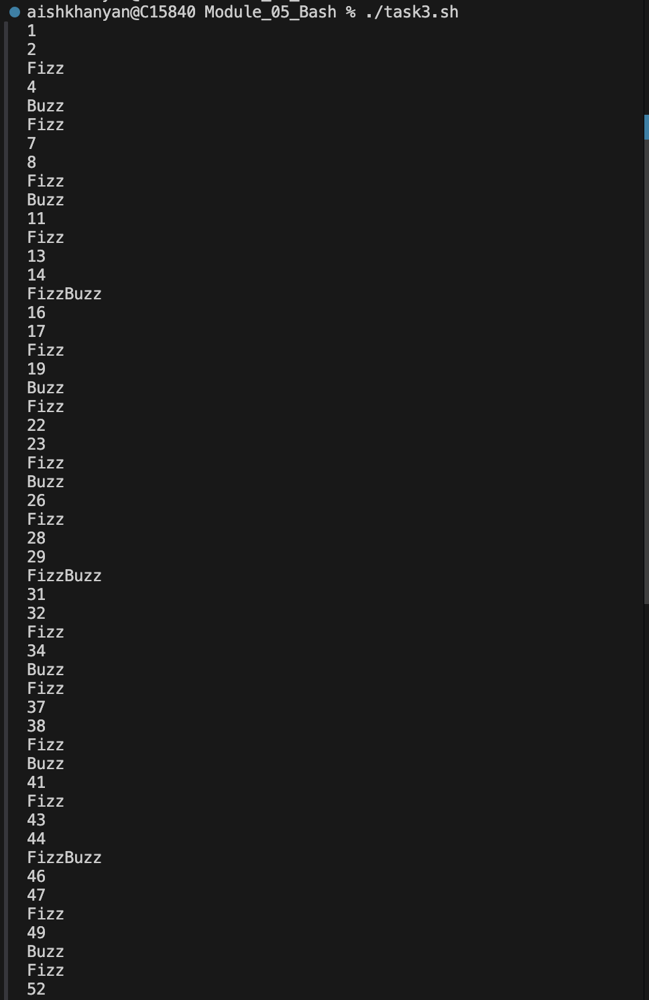
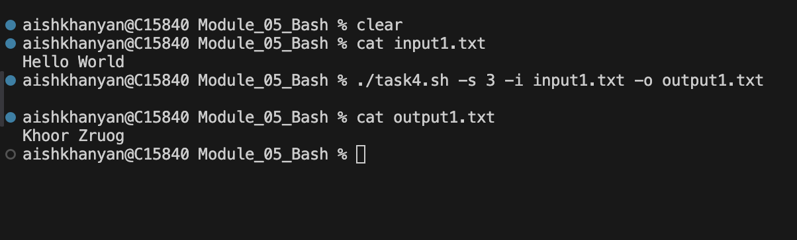
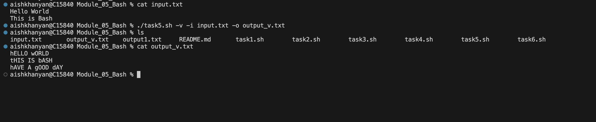
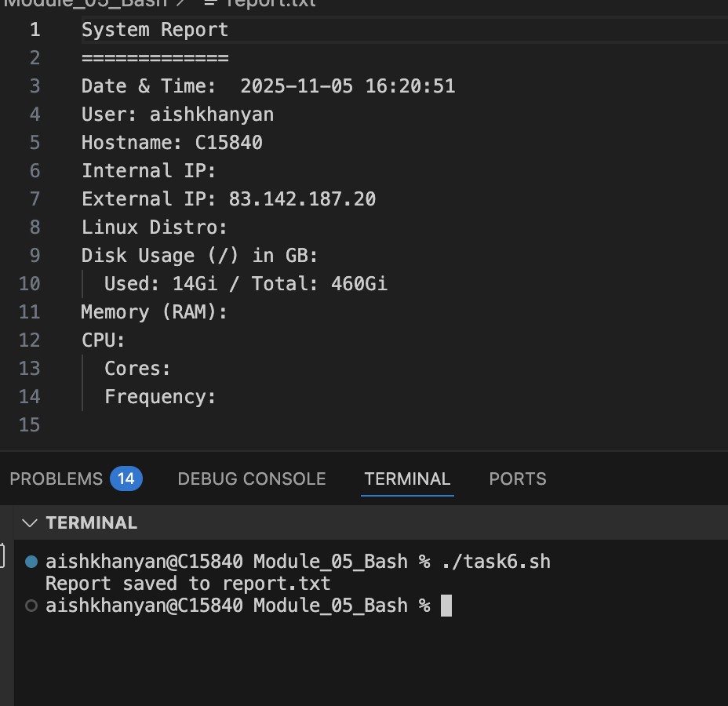

# Module 05 — Bash

Short exercises and scripts for Module 05 (Bash) of the internship. This module contains small scripts that demonstrate common shell scripting tasks: arithmetic and option parsing, file/text processing, simple algorithms, and system reporting.

## 📘 Contents

- `task1.sh` — Fibonacci calculator (interactive)
    
- `task2.sh` — Command-line calculator with option parsing
    
- `task3.sh` — FizzBuzz for numbers 1–100
    
- `task4.sh` — Caesar cipher file transformer
    
- `task5.sh` — Text utilities (view, replace, reverse, lower, upper)
    
- `task6.sh` — System report generator (`report.txt`)
    
