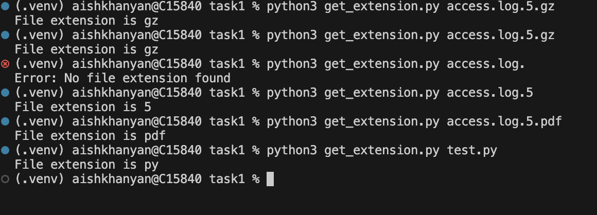
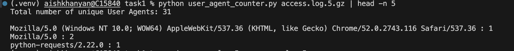
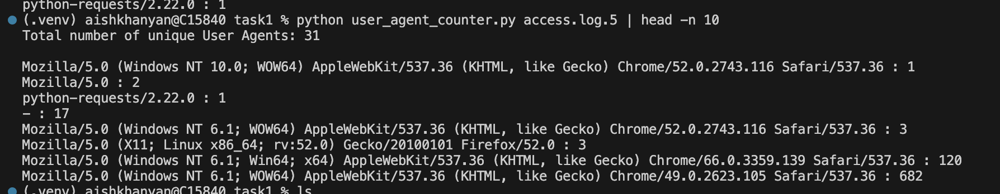
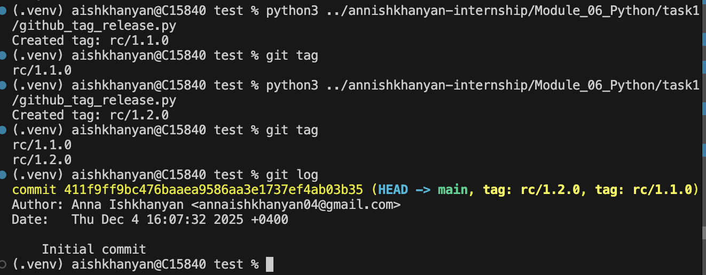
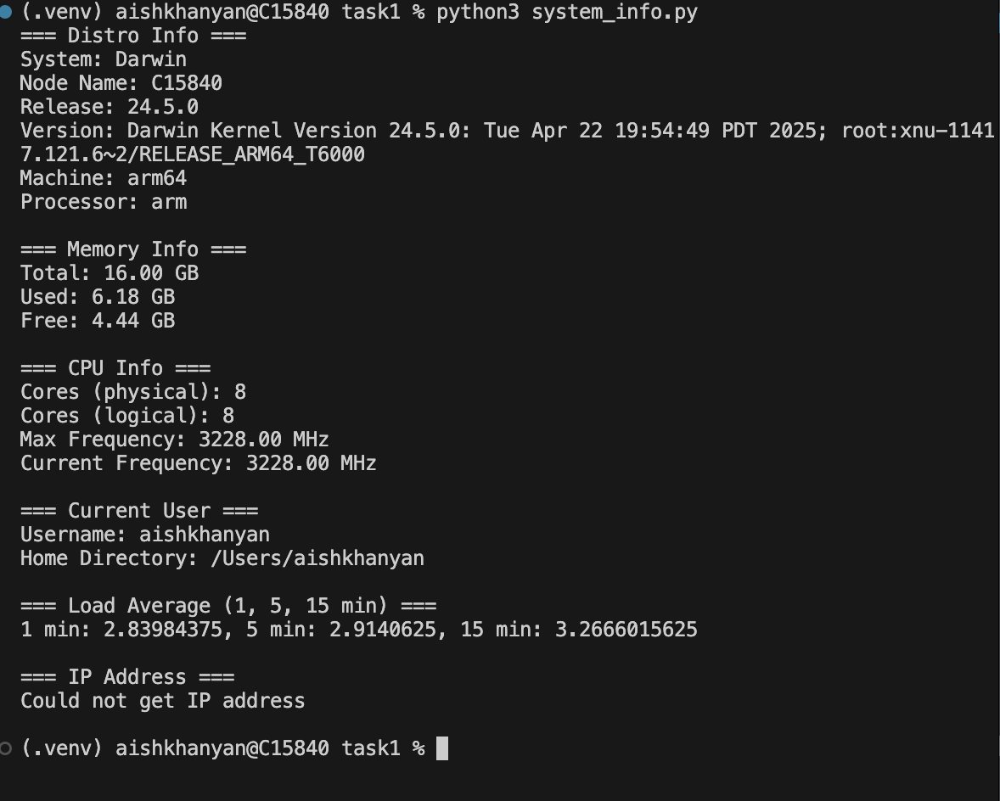
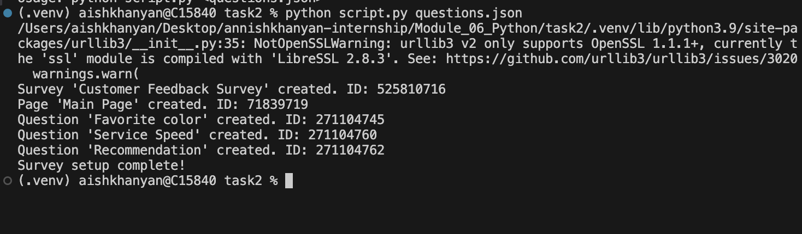

# Task 1

Install required packages:
```bash
pip install -r requirements.txt
```
## File Extension Checker

This script takes a filename as input and prints its extension. It supports filenames that contain multiple dots, hypens and always returns the final extension. If the filename does not contain an extension, the script prints an error message.

Usage:
``` bash
python3 get_extension.py <filename>
```



# User Agent Counter Script

This Python script reads an access log file, either a compressed .gz file or a normal .txt log file, and counts how many times each User-Agent string appears. It extracts the User-Agent and prints the total number of unique User-Agents and the count for each one.
Works with .gz compressed logs and regular .txt logs.

Usage:
```bash
python3 user_agent_counter.py <logfile>
```




# GitHub Tag Release Script

This Python script automatically creates rc tags and release tags in a Git repository. It checks existing tags, determines the next version number, and tags the latest commit on the main branch. RC tags follow the format rc/X.Y.Z. Each time the script is executed, the minor version (Y) is incremented.
If the script is run with the --create-release flag, it will create both the next RC tag and a realease tag.

Usage:

To create only an RC tag:
```bash
python3 github_tag_release.py
```

To create both an RC tag and a release tag:
```bash
python3 github_tag_release.py --create-release
```



# System Information Script

This Python script retrieves various system information.

### Usage

```bash
python3 system_info.py [OPTIONS]
```


Available Options:

- -d or --distro — Show distro information
- -m or --memory — Show memory usage
- -c or --cpu — Show CPU information
- -u or --user — Show user information
- -l or --load — Show load average
- -i or --ip — Show IP address

### Notes

On some systems CPU frequency information may not be fully available.

# Task 2

This script creates a SurveyMonkey survey using a JSON file. It uses the SurveyMonkey API and requires an ACCESS_TOKEN stored in a .env file.

## Features:

- Loads survey structure from a JSON file.

- Creates a survey.

- Creates a page inside the survey.

- Adds multiple-choice questions to the page.

## JSON structure example:
```JSON
{
  "Customer Feedback Survey": {
    "Main Page": {
      "Favorite color": {
        "Description": "What's your favorite color?",
        "Answers": ["Blue", "Black", "Red"]
      },
      "Service Speed": {
        "Description": "Do you have a pet?",
        "Answers": ["Yes", "No"]
      },
      "Recommendation": {
        "Description": "Which one would you prefer to have as a pet?",
        "Answers": ["Cats", "Dogs"]
      }
    }
  }
}

```

## Setup instructions:
- Install required packages:
```bash
pip install -r requirements.txt
```
- Create a .env file containing:
```bash
ACCESS_TOKEN=your_surveymonkey_api_token
```

## Usage:
```bash
python script.py questions.json
```


The script prints the created survey ID, page ID, and question IDs.
