# Module 07: Java

# Step 1: Download/install Tomcat server.
I downloaded Apache Tomcat 9.0.113 and extracted it into /opt/tomcat on WSL Ubuntu. Then I started it using the Tomcat startup scripts. This created a running Tomcat instance with the standard directory structure (bin/, conf/, logs/, webapps/, etc.).

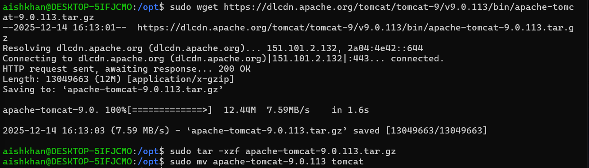
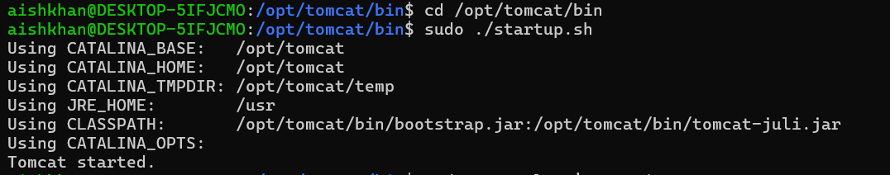

# Step 2: Verify that it works by visiting the root page
After starting Tomcat instance I visited http://localhost:8080 and the following page was displayed.

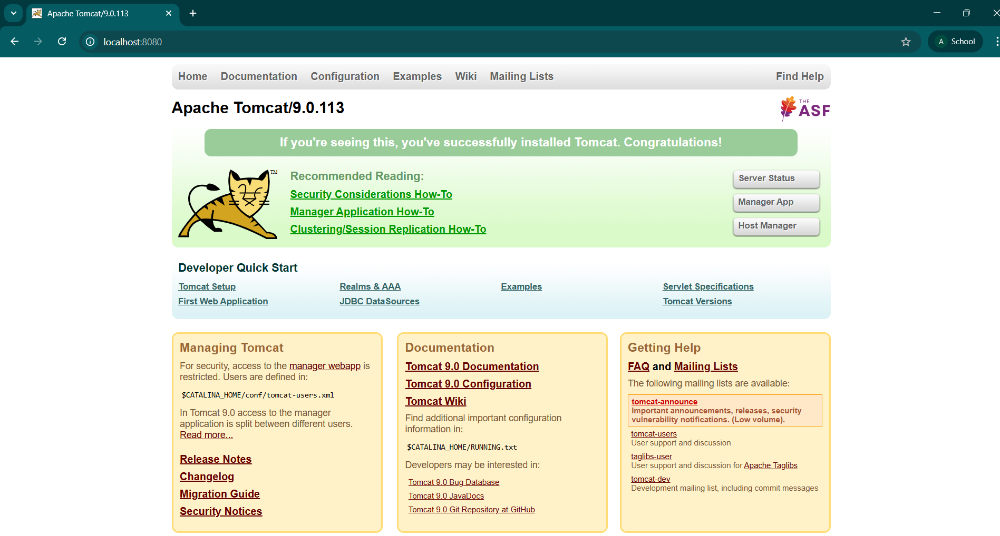

#### What ports are used by the java process?
Java process uses:
- 8080 for HTTP
- 8005 for the shutdown port
- 8009 for Apache JServ Protocol

Below, I used Windows CMD to verify the process ID and its corresponding port which is 8080.
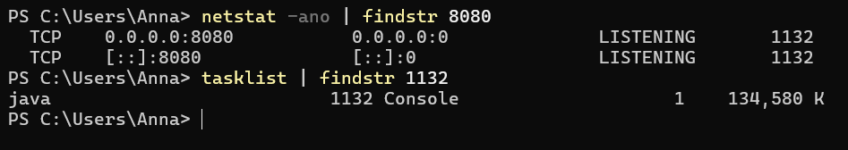

# Step 3: Remove all default applications (including manager), restart Tomcat.
After removing all the default web applications and restarting Tomcat, http://localhost:8080 returned HTTP 404, which confirmed that the default applications had been removed successfully.
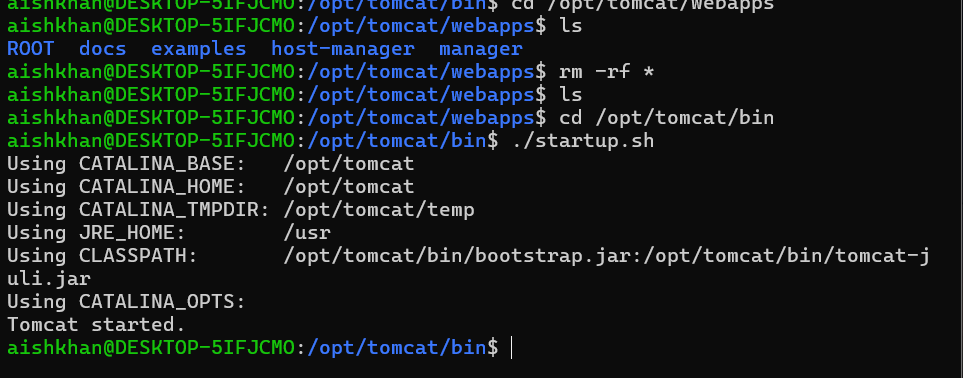
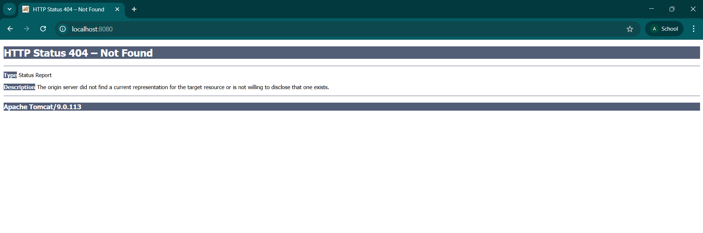

# Step 4: Download Jenkins WAR and deploy into Tomcat.
I downloaded the Jenkins WAR file and deployed it by placing it into Tomcat’s webapps directory. Tomcat automatically deployed the WAR as a web application on startup.

# Step 5: Verify that application works
After deployment, I visited http://localhost:8080/jenkins. The Jenkins page appeared which confirms that Jenkins was successfully deployed and served through Tomcat.
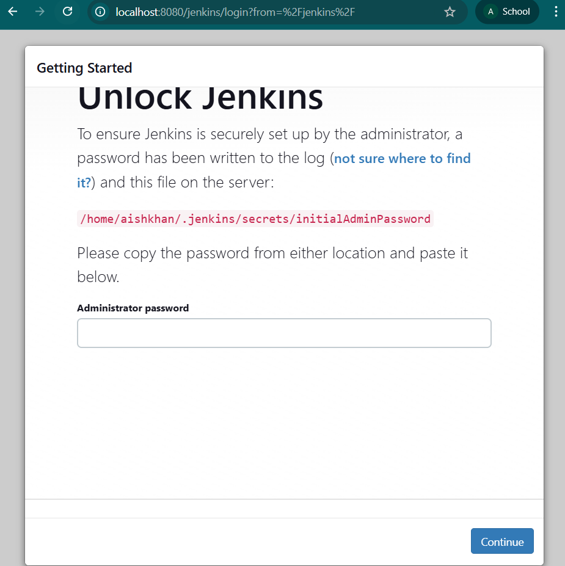

# Step 6: Enable JMX in Tomcat.
I enabled JMX by adding the required JVM system properties to Tomcat’s startup options via CATALINA_OPTS in setenv.sh. This exposed a JMX endpoint that tools like kConsole can connect to for monitoring the JVM and Tomcat.

#### What ports are used by the java process?
After enabling JMX, the Java process uses the same Tomcat ports plus the JMX port:

- 8080 HTTP

- 8005 shutdown

- 8009 AJP

- 9010 JMX

#### Change CATALINA_OPTS to use same for RMI as for JMX
I configured JMX so that the RMI port is the same as the JMX port (both set to 9010). This avoids the common RMI behavior where the extra random port is opened which makes connecting harder.
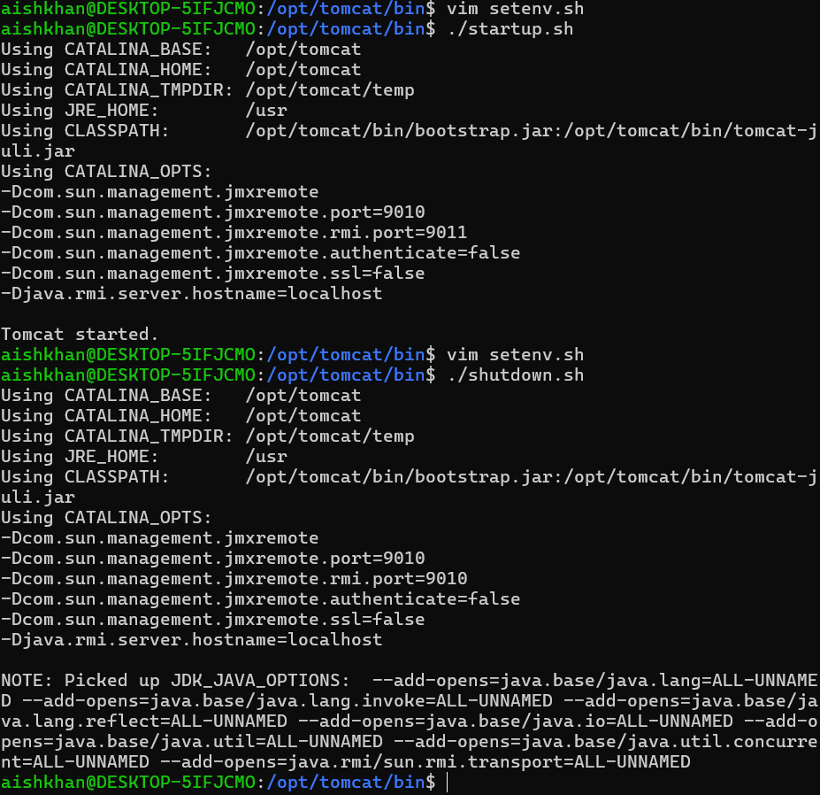

#### What ports are used by the java process?
With JMX and RMI configured to use the same port, the ports remain the same as above.

# Step 7: Rerun tomcat with min heap size 10M and max heap size 20M.
I restarted Tomcat with a very small heap (minimum 10 MB, maximum 20 MB). Tomcat failed to run correctly under this memory constraint during startup.
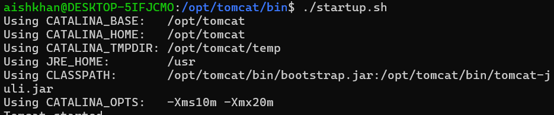

####  What type of error will you get?
The JVM throws a memory failure:
```
java.lang.OutOfMemoryError: Java heap space
```

This happens because Tomcat require much more than 20 MB heap to load classes, initialize components and deploy webapps.

####  Increase min heap size to 1G and max heap size to 3G, enable parallel garbage collector.
I increased the heap size and enabled the Parallel Garbage Collector. After restarting Tomcat with these settings it started normally and ran without any memory errors.
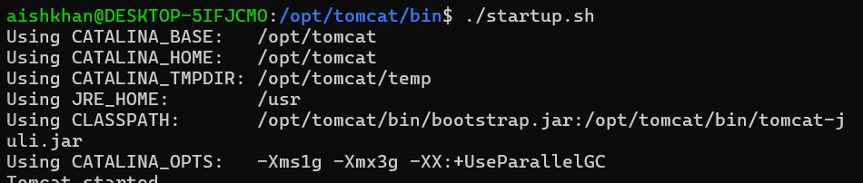

# Step 8: Connect by JConsole to Tomcat and look around.
Using JConsole on Windows, I connected to Tomcat through the JMX endpoint at localhost:9010. In JConsole I reviewed JVM and application metrics: heap memory usage, thread activity, loaded classes, CPU usage.
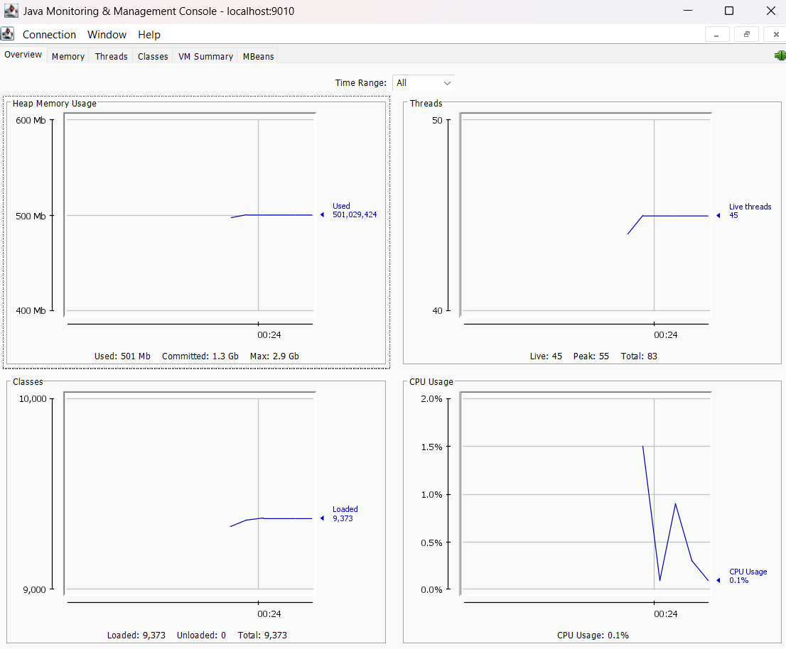

# Step 9: Stop Tomcat.
I stopped Tomcat using the shutdown script and verified that the Tomcat Java process was no longer running.

# Step 10: Launch Jenkins WAR as a standalone application, verify that it works.
Finally, I ran the Jenkins WAR directly as a standalone application (without Tomcat). Jenkins started successfully using its web server and became available at http://localhost:8080, where I used the adinistrator's password provided and got access to the main page.

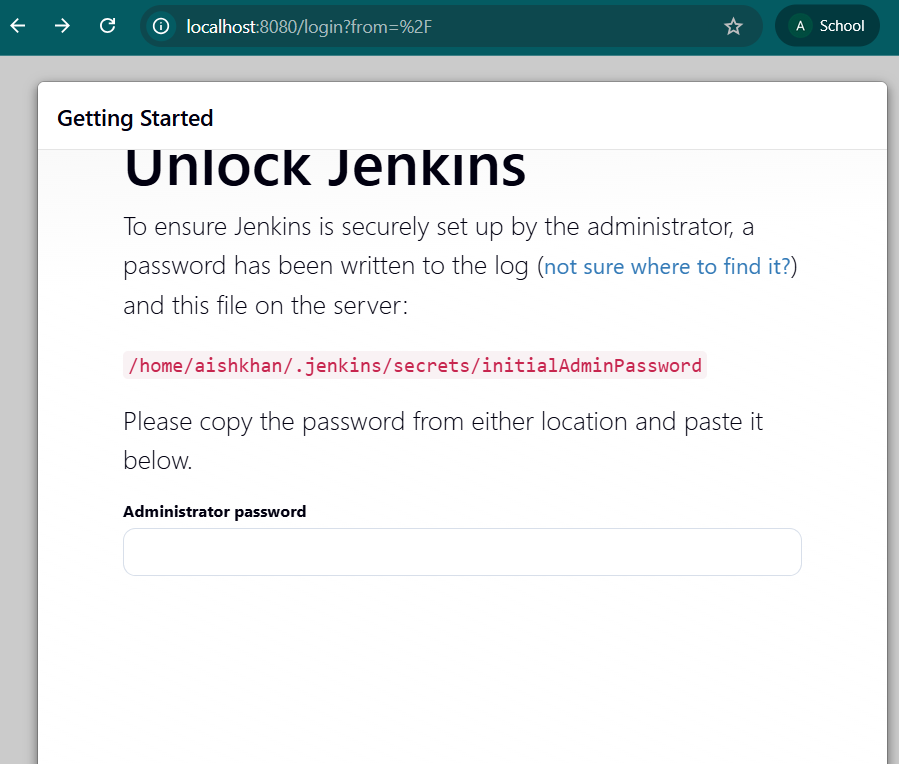
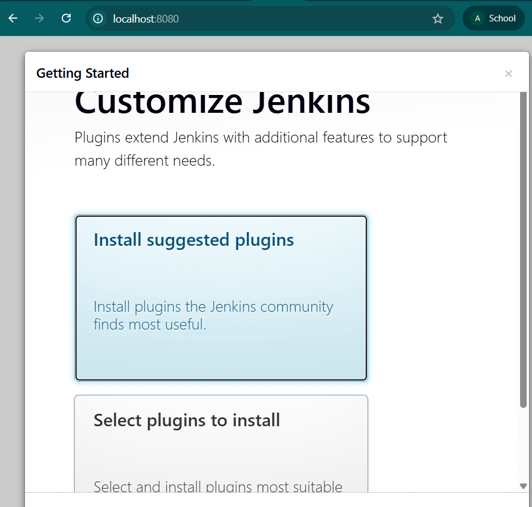
