# Maven Practical Task
## Step 1: Environment Setup

Forked repository: https://github.com/anna-ishkhanyan/spring-petclinic-1.git

The latest versions of Java and Apache Maven were installed locally. The installation was verified using java -version and mvn -version.

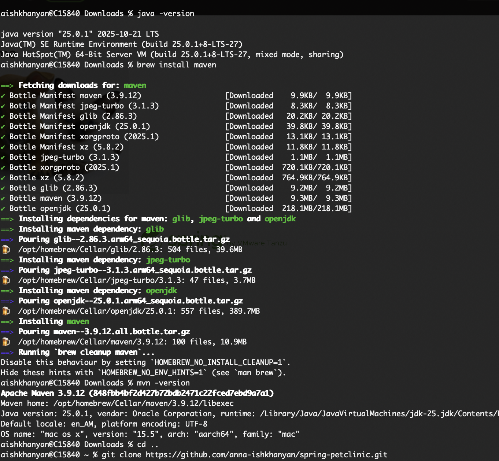

## Step 2: Project Validation

The project configuration was validated using Maven to ensure that the structure and metadata were correct before building.

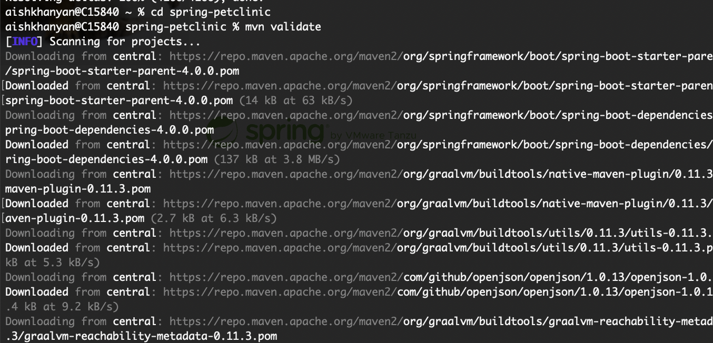

## Step 3: Build

The project was built from source code. Maven resolved dependencies, compiled the source files, and generated a JAR artifact.

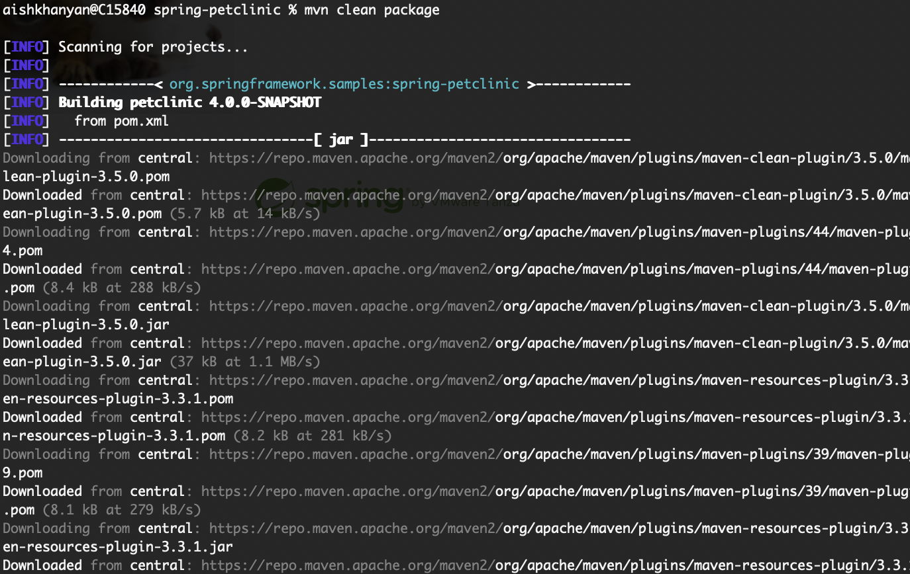

## Step 4: Application Run

The application was started locally and accessed through a web browser. The Spring Petclinic web interface loaded successfully on the default port.

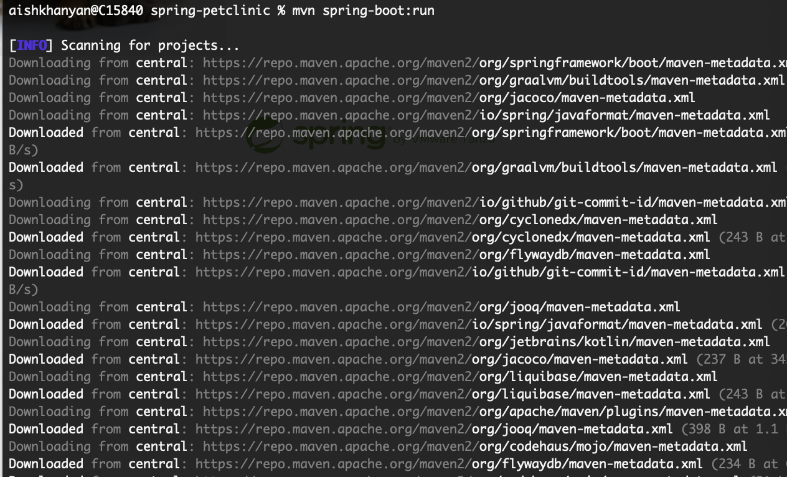
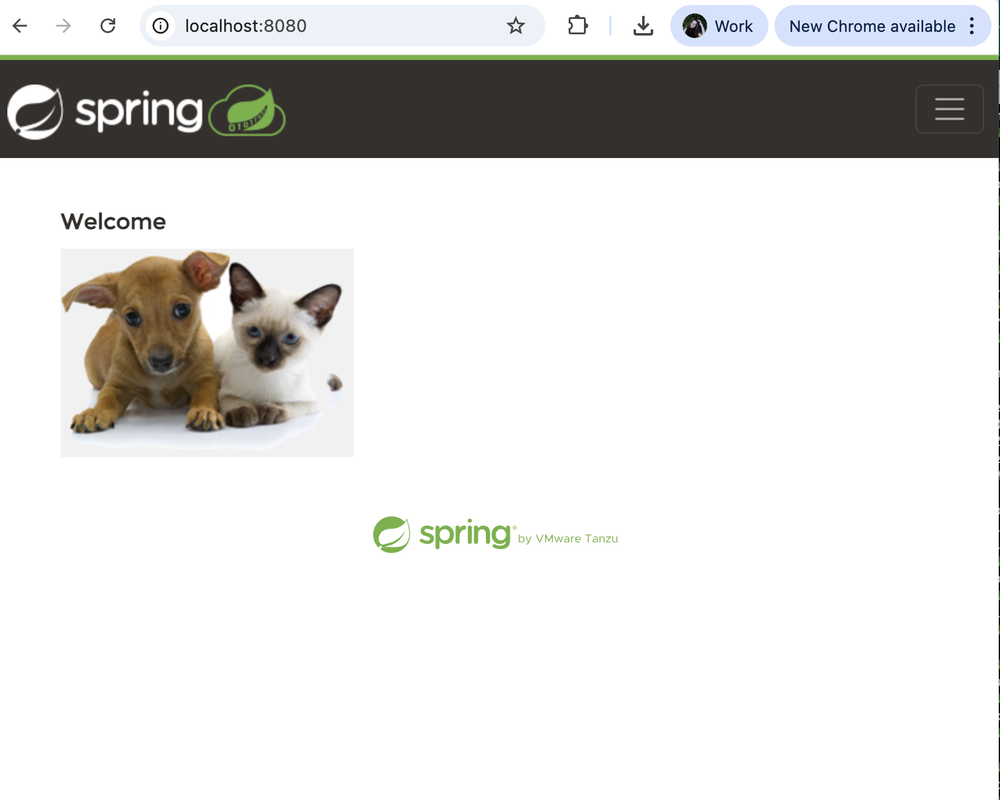

## Step 5: Version Update

The project’s major version was increased according to the task requirements.

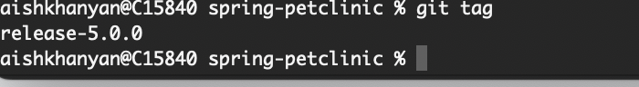
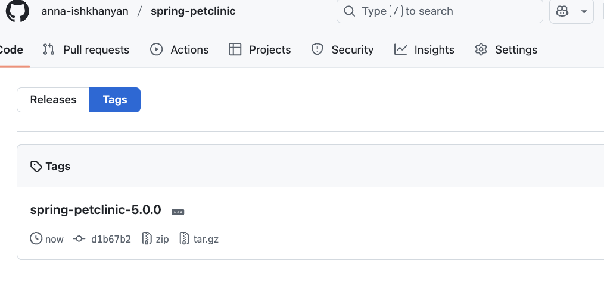

## Step 6: SCM Configuration

Source Control Management (SCM) information was added to the pom.xml to enable the Maven release process.

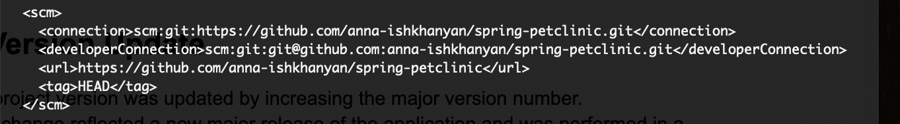
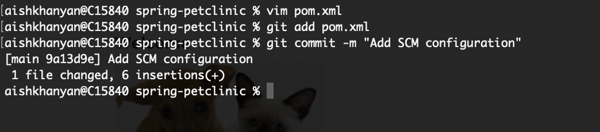

## Step 7: Release Preparation

The project was transitioned from a snapshot version to a release version. A release commit was created and a corresponding Git tag was generated and pushed to the remote repository.

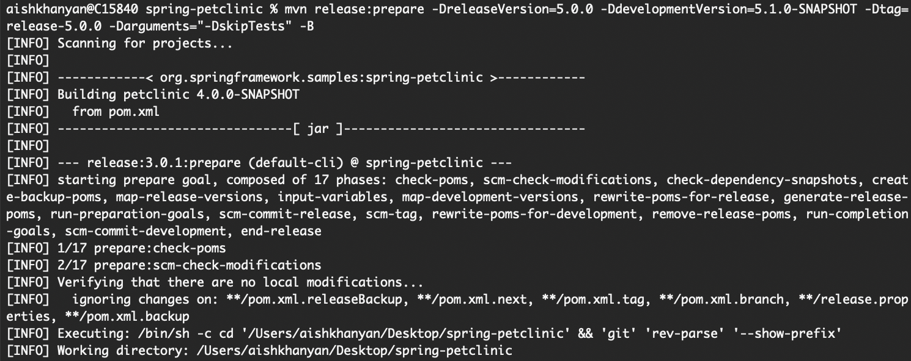

## Step 8: Release Execution

The release execution phase was initiated. The project was checked out from the created Git tag to ensure the release was built from a stable and immutable state. The process failed at the deployment stage because the project does not define a distributionManagement repository, which is expected for a demo project and acceptable for this task. The task required attempting the release process. Since the project is not configured for deployment to a remote Maven repository, the deployment failure is expected behavior and does not indicate an error in configuration or execution.

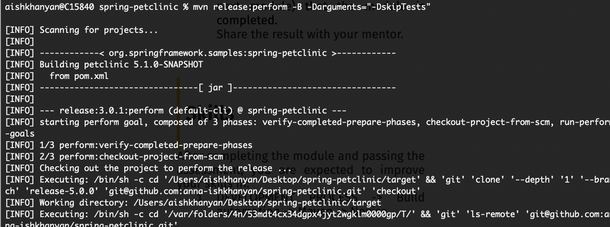

## Step 9: Cleanup

Temporary files and metadata created during the release process were removed, returning the working directory to a clean state.

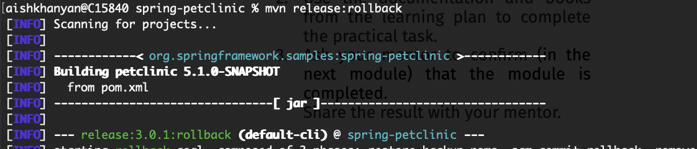
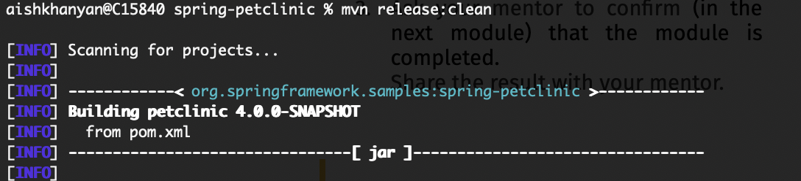

## Final Result

- The project was built and executed successfully.
- The major version was updated correctly.
- Release preparation completed with proper commits and tagging.
- Release artifacts were generated and stored locally.
