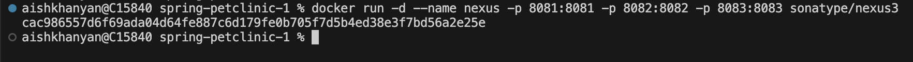
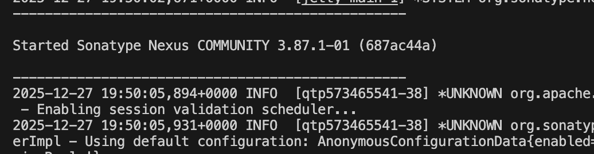
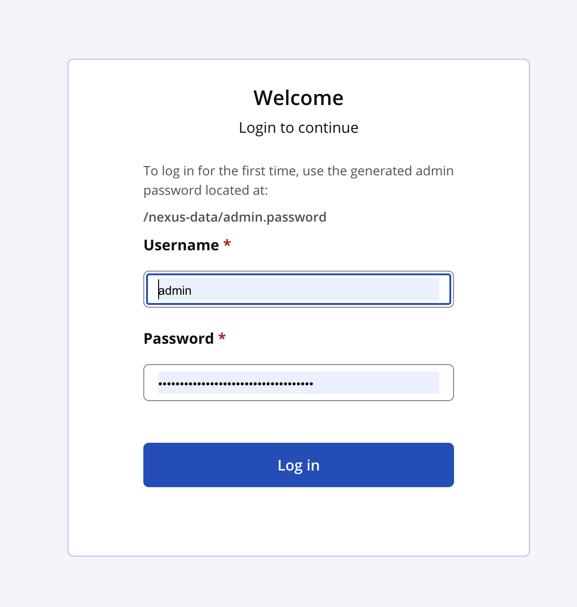
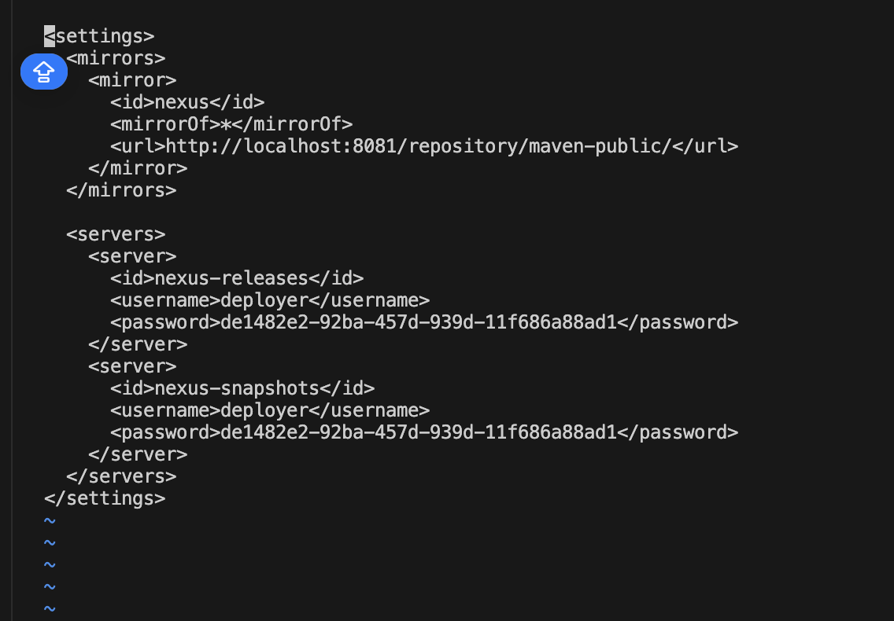
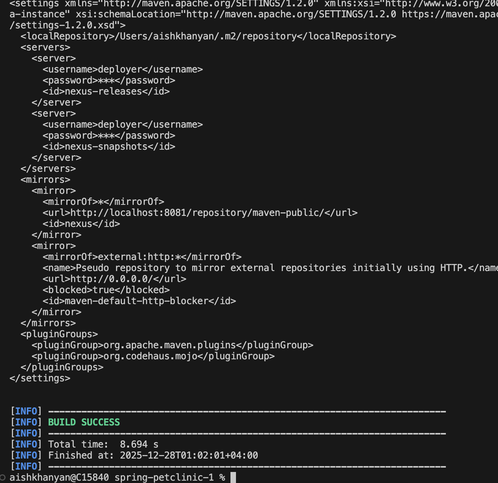
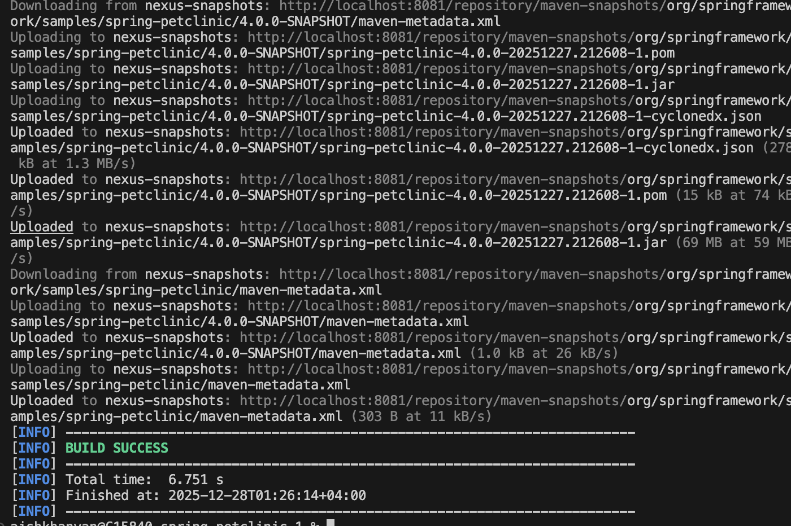
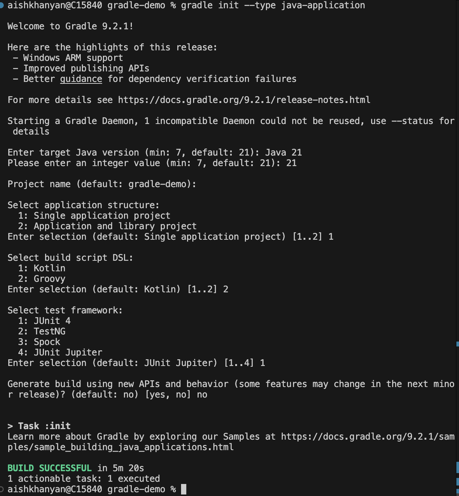
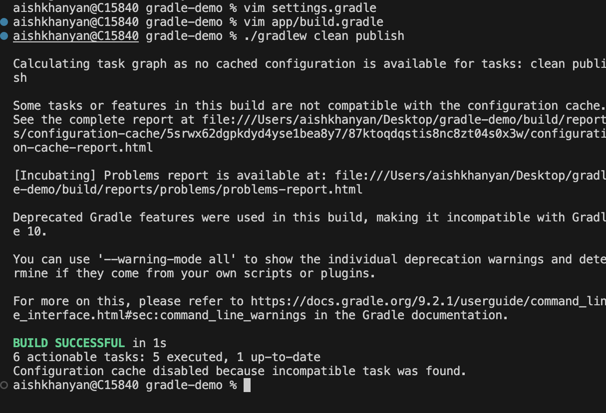
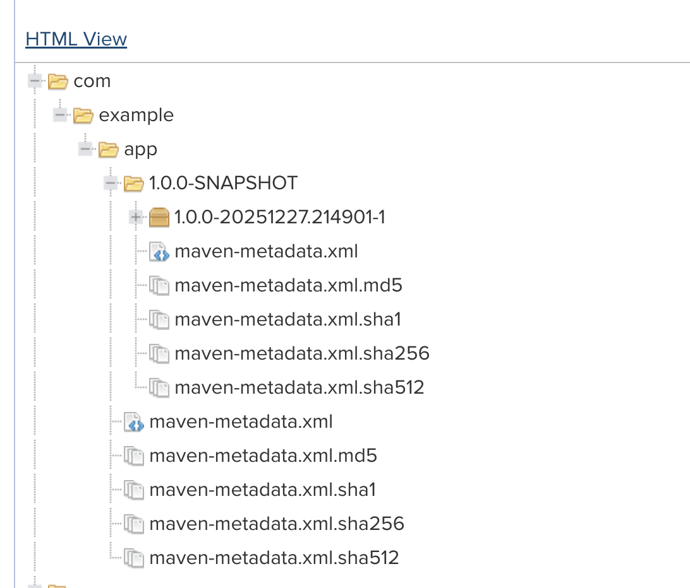

# Module 10: Nexus

The purpose of this task was to set up a local artifact repository using Sonatype Nexus Repository, configure build tools (Maven and Gradle) to use it and successfully publish artifacts to the repository.

### Nexus Repository Setup

Nexus Repository was installed using Docker.
The container was started and exposed on port 8081, allowing access via a web browser.



After startup, the initial admin password was retrieved from the container and used to log in to the Nexus UI.




### Manage repository configuration

The following repositories were created:

- maven-central for Maven Central dependencies
- maven-releases for storing release artifacts
- maven-snapshots for storing snapshot artifacts
- maven-public to be used as the main access point for Maven and Gradle

### Maven Configuration

Maven was configured to use Nexus as a mirror via the settings.xml file.



This configuration ensures that all dependencies and deployments go through Nexus.

### Uploading Spring Petclinic Artifact

The Spring Petclinic project was used as a sample application.

The following was added to the pom.xml:
```
<distributionManagement>
  <repository>
    <id>nexus-releases</id>
    <url>http://localhost:8081/repository/maven-releases/</url>
  </repository>
  <snapshotRepository>
    <id>nexus-snapshots</id>
    <url>http://localhost:8081/repository/maven-snapshots/</url>
  </snapshotRepository>
</distributionManagement>
```

Deployment was performed using:
```
mvn clean deploy -DskipTests
```



### Gradle Configuration

A new Gradle project was created using:
```
gradle init
```


### Gradle Repository Configuration

In settings.gradle:
```
dependencyResolutionManagement {
    repositories {
        maven {
            url "http://localhost:8081/repository/maven-public/"
            allowInsecureProtocol = true
        }
    }
}
```
### Publishing Configuration

In build.gradle:
```
plugins {
    id 'java'
    id 'maven-publish'
}

group = "com.example"
version = "1.0.0-SNAPSHOT"

publishing {
    publications {
        mavenJava(MavenPublication) {
            from components.java
        }
    }

    repositories {
        maven {
            url "http://localhost:8081/repository/maven-snapshots/"
            credentials {
                username = "admin"
                password = "******"
            }
            allowInsecureProtocol = true
        }
    }
}
```

The artifact was uploaded using:
```
./gradlew clean publish
```



Artifacts were successfully verified in Nexus.