# Module 11: Docker
## Task 1
Repository: https://github.com/anna-ishkhanyan/spring-petclinic.git

This task demonstrates containerization of the Spring petClinic application.

### Step 1 
Cloned the repository of the app:
```
git clone https://github.com/spring-projects/spring-petclinic.git
cd spring-petclinic
```

### Step 2

The application is first built locally, producing a JAR file.
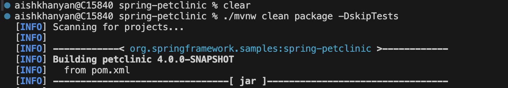
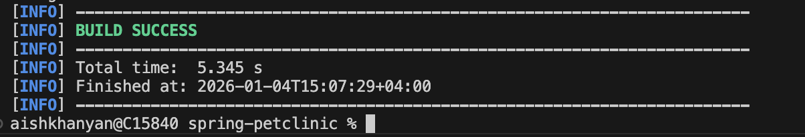


After the build the artifact is saved at target directory.

### Step 3 

This Dockerfile uses the already built JAR file and runs it inside a minimal JRE image.

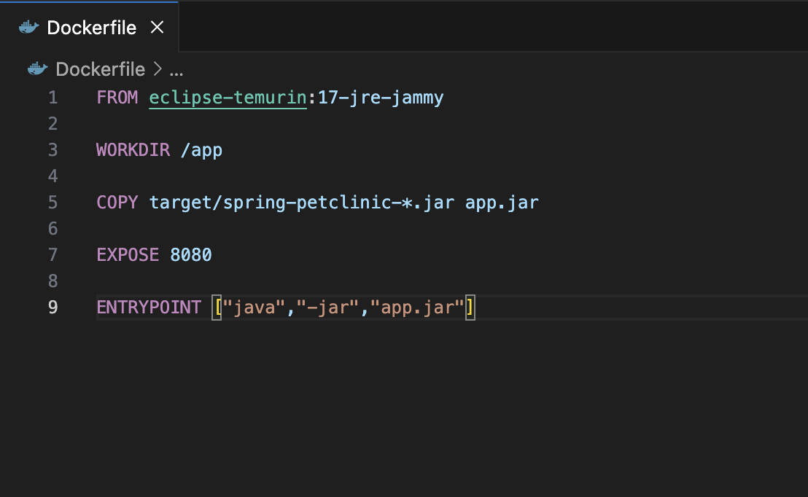


Building:
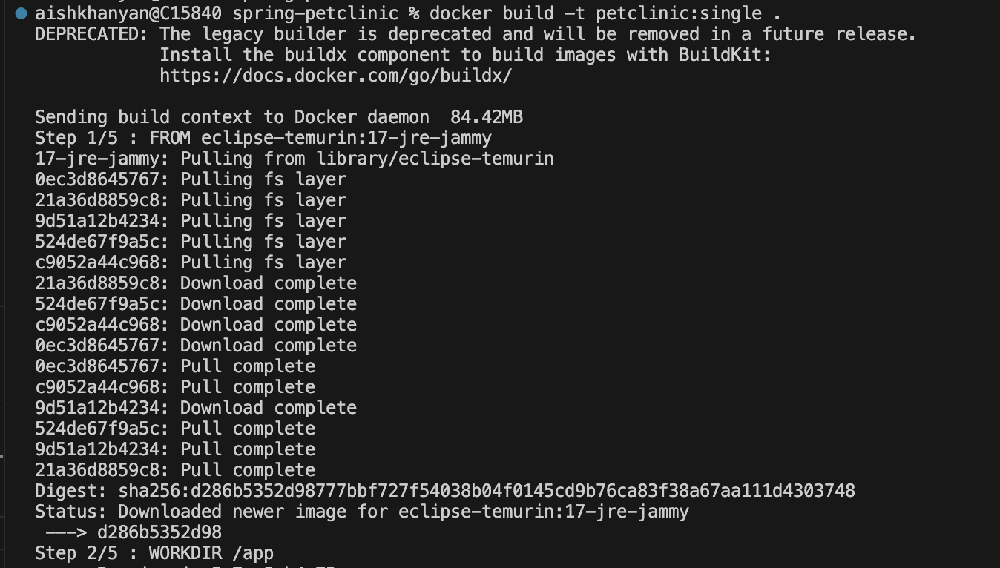

Running:
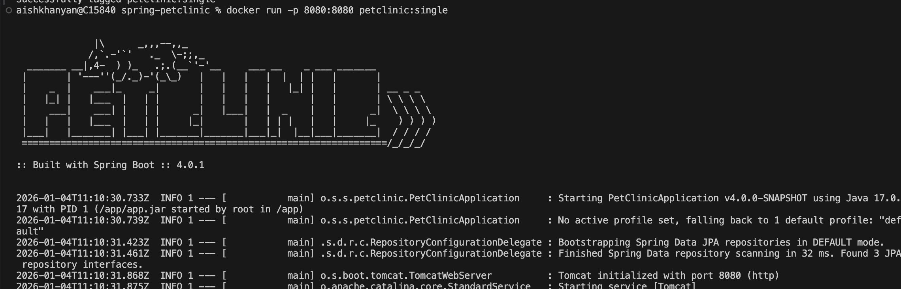
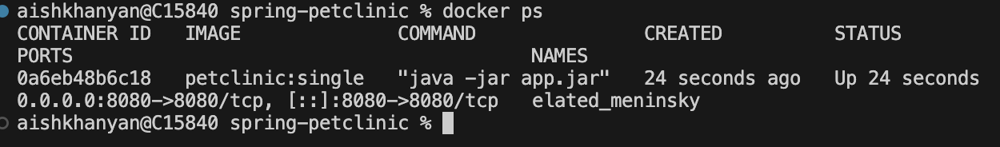


### Step 4
At this step Multi-Stage Dockerfile is created.

This approach builds the application inside the Docker image, then copies only the final JAR into a minimal runtime image.
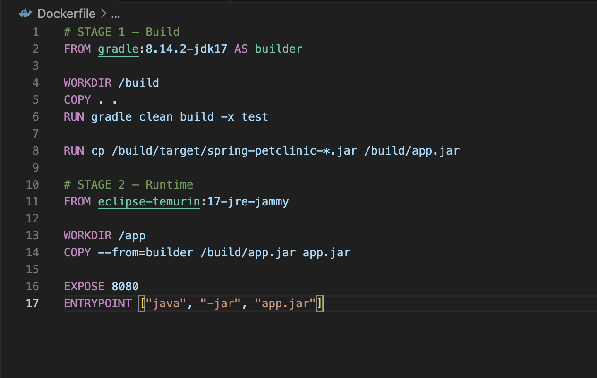

Building: 
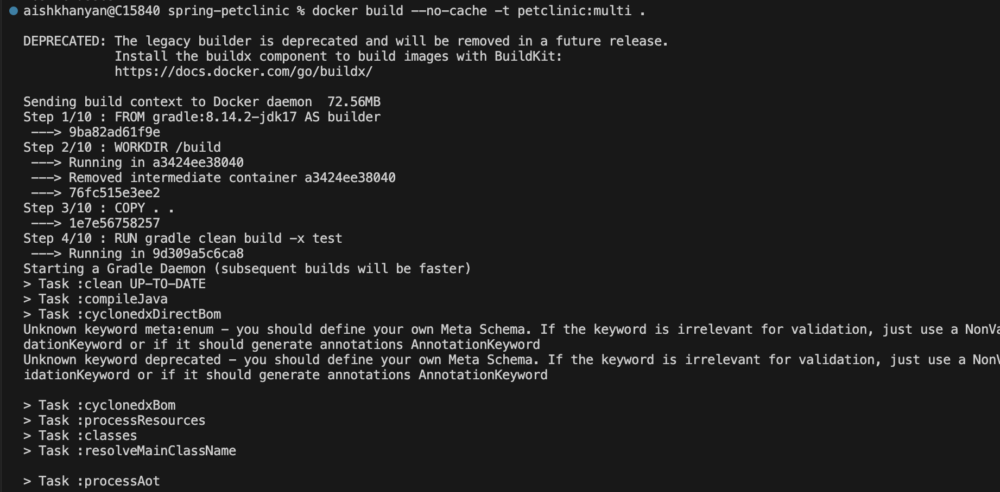

Running:
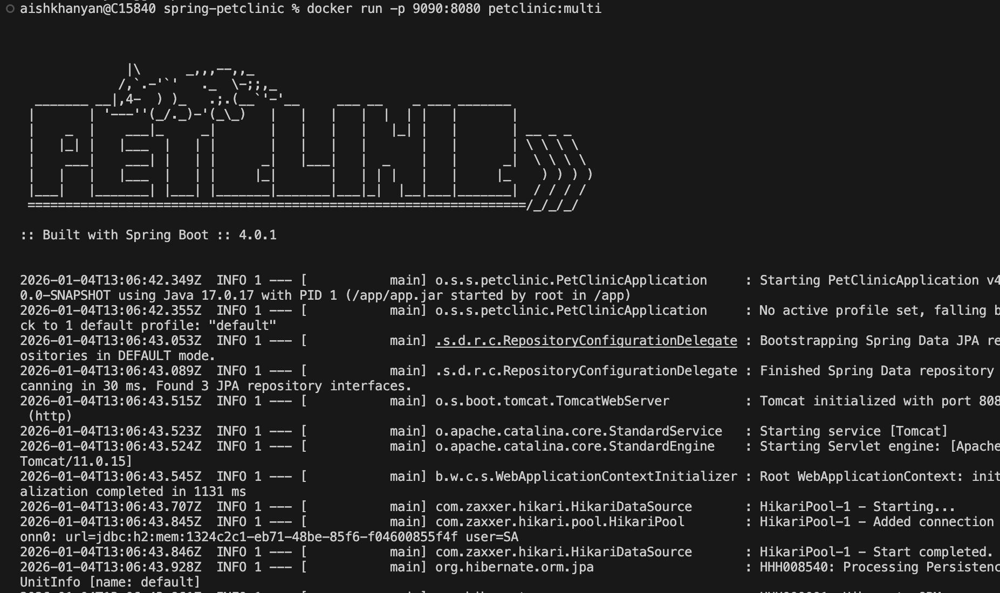


Application becomes available at:

http://localhost:9090

### Step 5

Docker Compose is used to start two containers automatically: Spring PetClinic application and MySQL database

docker-compose.yml
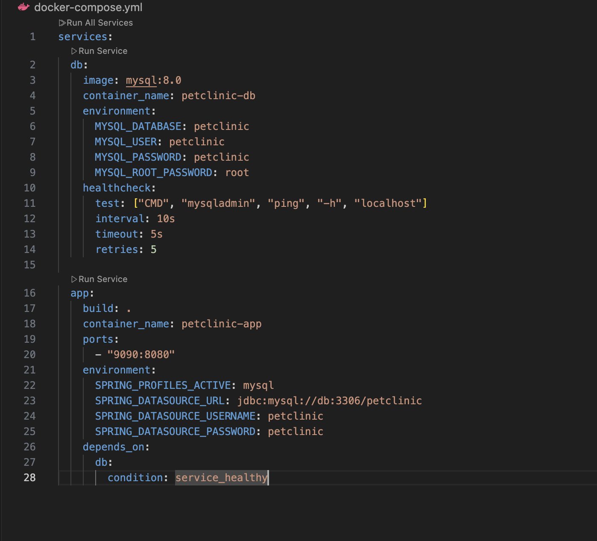

### Step 6 
Running with docker compose:
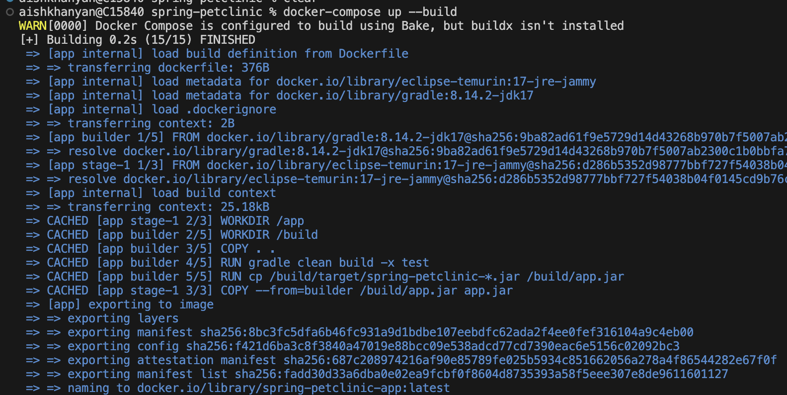
Result:
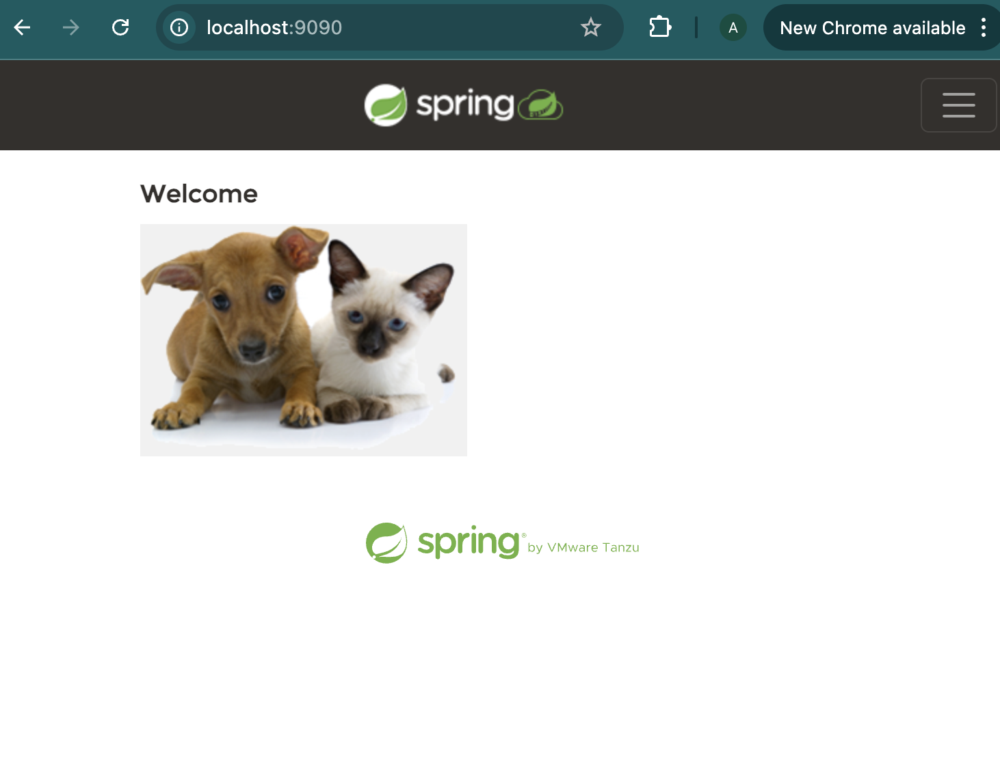

## Task 2: Part 1
### Step 1

A Docker (hosted) repository was created in Nexus Repository Manager:
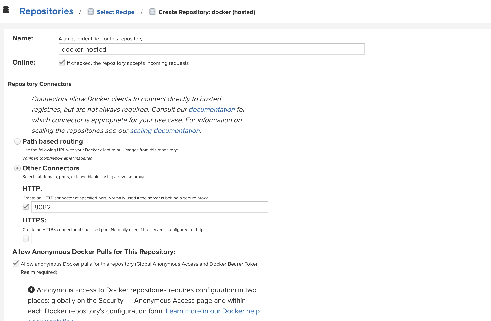

### Step 2
Docker was authenticated against the Nexus Docker registry:
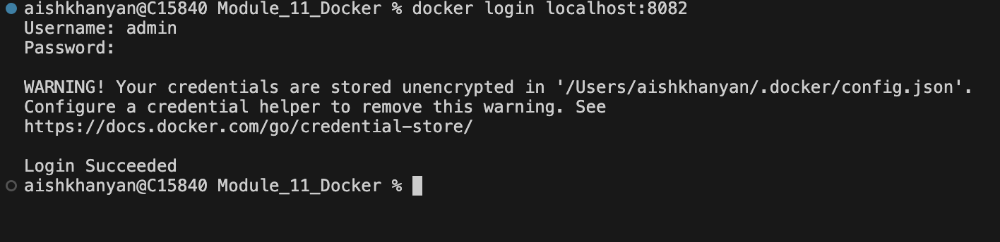

### Step 3

The locally built image(spring-petclinic-app:latest) was tagged and pushed to Nexus:
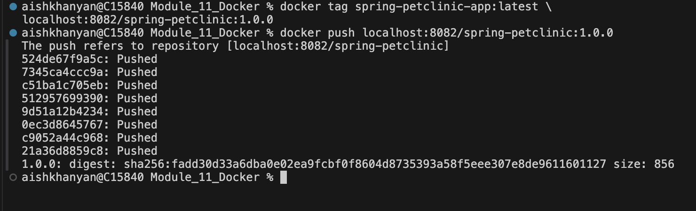


The image was uploaded in the Nexus UI.


## Part 2
### Step 1
A private repository was created in Amazon ECR.
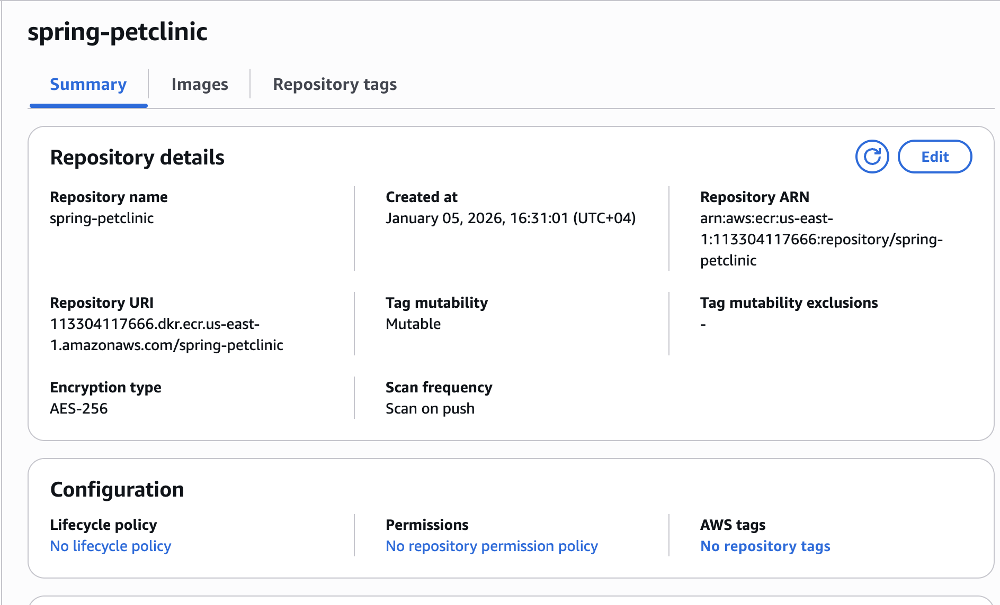

### Step 2

Docker was authenticated to ECR:
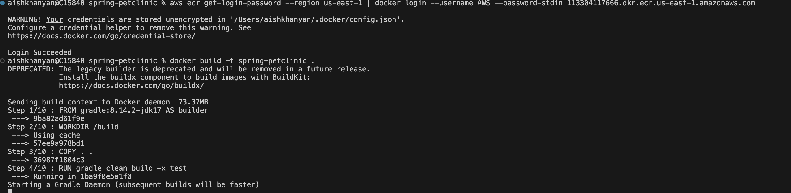

### Step 3
The same Docker image was tagged and pushed to ECR:
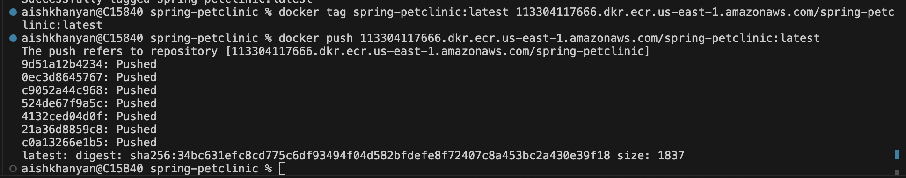


The image appeared successfully in the ECR repository.
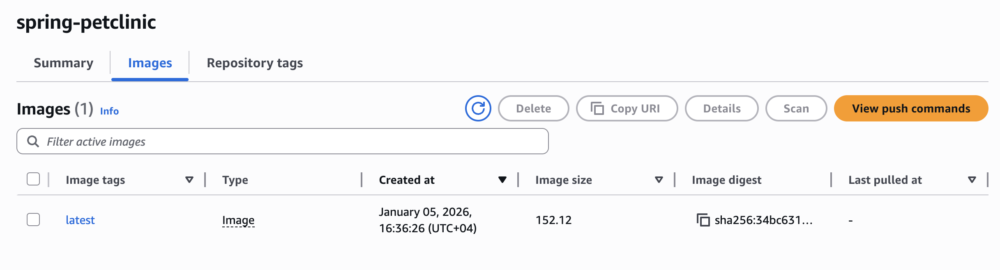

### Step 4

Initially, the security scan failed with the error 
```UnsupportedImageTypeException```.
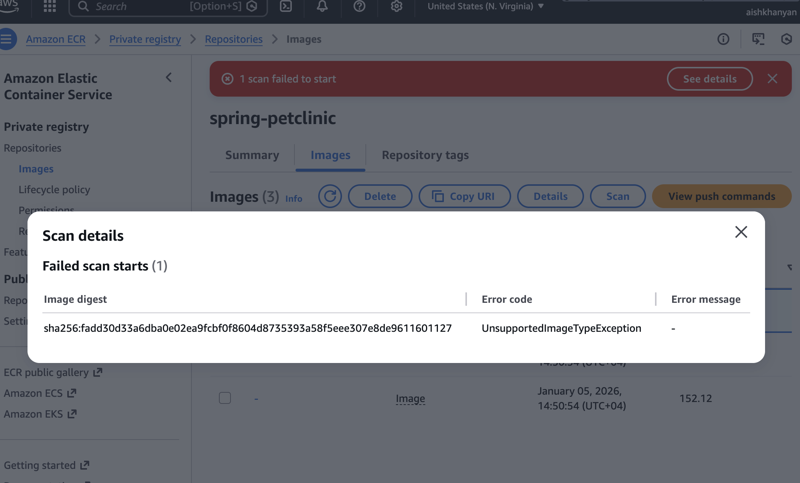

This happened because the Docker image was built as a multi-architecture image. Amazon ECR basic scanning does not support Image Index artifacts, which caused the scan to fail.

To resolve this issue I used this command:
```
docker build --platform linux/amd64 -t spring-petclinic:1.0.0 .
```
After rebuilding and pushing the image again, the security scan completed successfully.
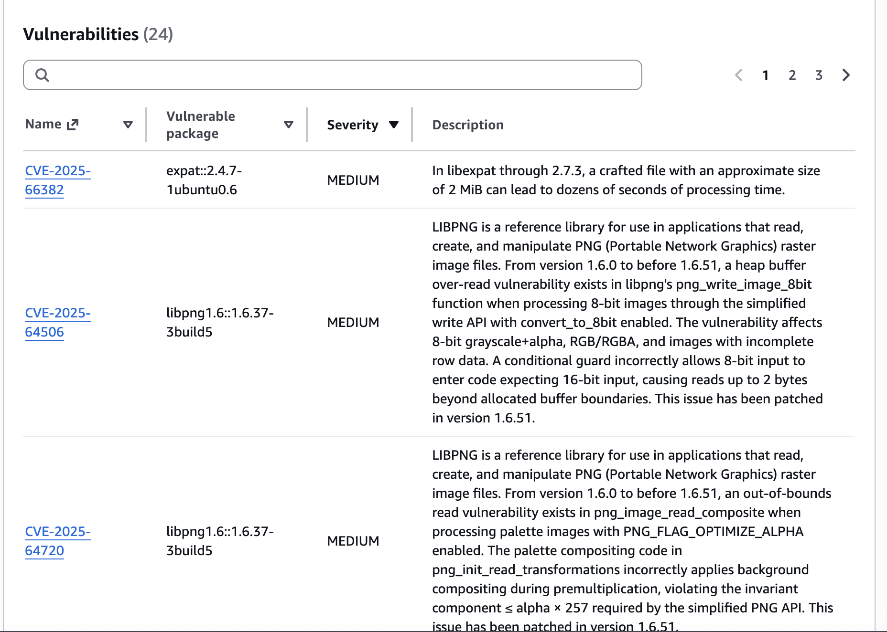
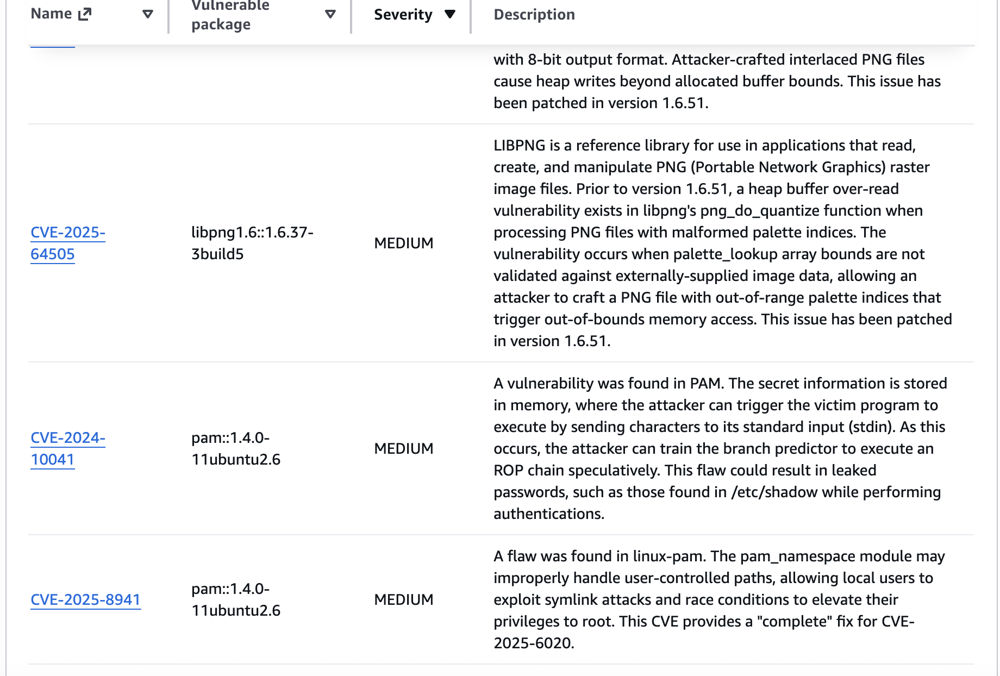
The scan results showed no Critical or High severity vulnerabilities. Most of the detected vulnerabilities were Medium or Low severity and originated from the base Ubuntu image, not from the application itself. This is common when using general-purpose operating system base images.

To reduce such findings in the future, possible approaches include using smaller base images, rebuilding images regularly to apply security updates.