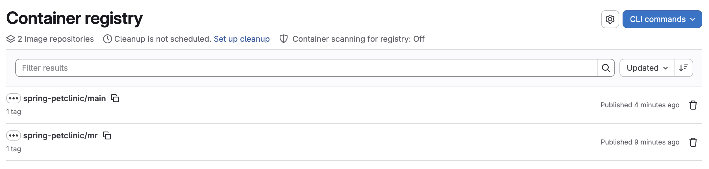
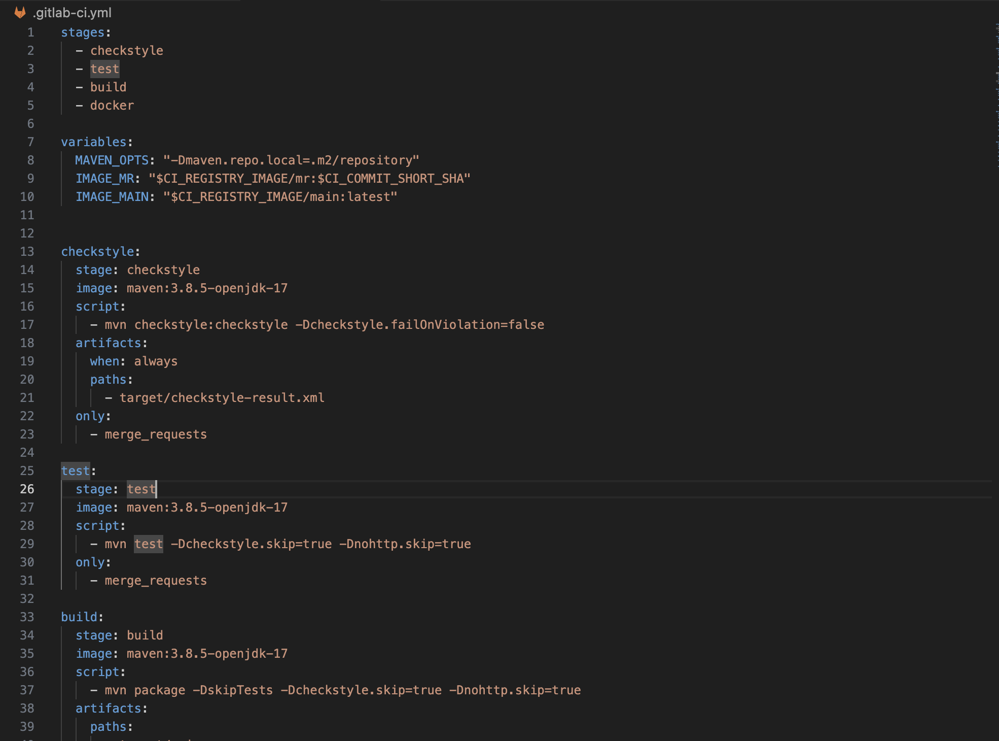
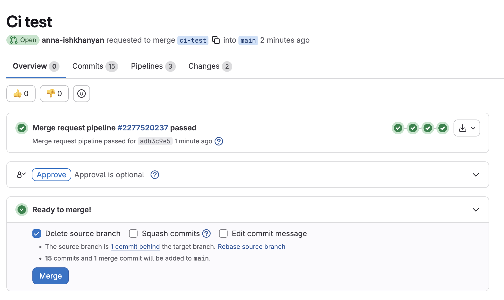
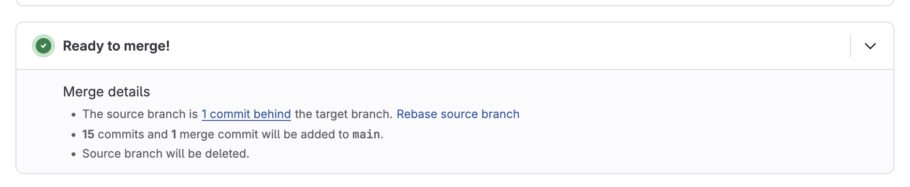
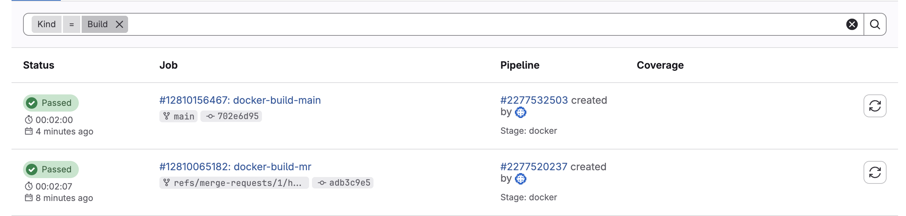

# GitLab Module

### Step 1: Create GitLab Repository

Imported the repository in GitLab from Github.

Added a Dockerfile to containerize the application.

### Step 2: Docker Image 
I used GitLab Container Registry with two image names:

mr: images built for merge requests

main: image built from the main branch

This approach keeps all images in one registry and clearly separates temporary and stable images.

### Step 3: CI/CD Pipeline

A .gitlab-ci.yml file was added to define the CI/CD pipeline.

The pipeline consists of four stages:

- checkstyle

- test

- build

- docker

### Step 4: Merge Request Pipeline

For every merge request, the pipeline runs the following jobs using the Docker image.

- Checkstyle

  Runs Maven Checkstyle plugin

  Generates a code style report

  Stores the report as a pipeline artifact

- Test

  Runs unit tests using Maven

  Ensures application correctness

- Build

  Builds the application without running tests

  Produces the JAR file

- Docker Image

  Builds a Docker image using the project Dockerfile

  Tags the image with CI_COMMIT_SHORT_SHA

  Pushes the image to the mr image name in GitLab Container Registry

### Step 5: Main Branch Pipeline

When changes are merged into the main branch:

- A Docker image is built using the same Dockerfile

- The image is pushed to the main image name in GitLab Container Registry

- This image represents the stable version of the application.

